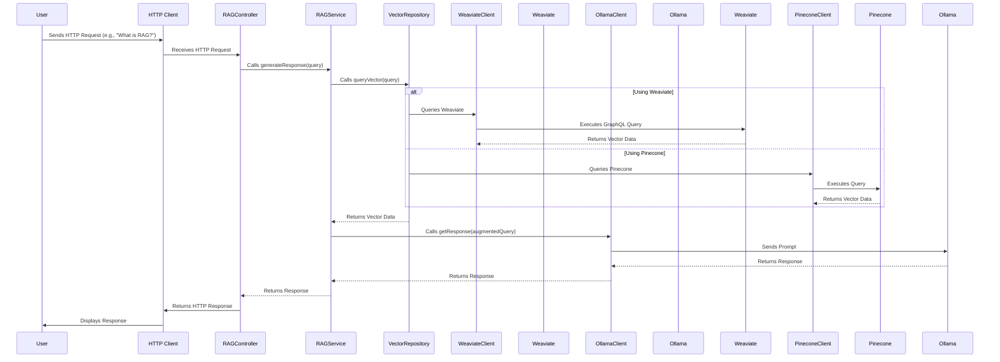

# RAG Node.js API

## Overview
This project implements a Retrieval Augmented Generation (RAG) API using Node.js and TypeScript. It leverages Langchain for RAG, Pinecone as the vector database, and Ollama as the language model, all while adhering to clean architecture principles.

## System Architecture Sequence Diagram

Here's a sequence diagram illustrating the system architecture and request flow:



## Project Structure
The project is organized into several layers, following the clean architecture approach:

- **src/application**: Contains services and interfaces for application logic.
- **src/domain**: Contains models and repositories for business logic.
- **src/infrastructure**: Contains database clients, LLM clients, and configuration files.
- **src/presentation**: Contains controllers, routes, and middleware for handling HTTP requests.
- **src/tests**: Contains unit and integration tests, as well as HTTP request tests.

## Setup Instructions

### Prerequisites
- Node.js (version 14 or higher)
- Docker and Docker Compose

### Installation
1. Clone the repository:
   ```
   git clone <repository-url>
   cd rag-nodejs-api
   ```

2. Install dependencies:
   ```
   npm install
   ```

3. Set up environment variables:
   Create a `.env` file in the root directory and add your configuration settings.
### Ollama Setup

1.  **Pull a Model:**  Ollama requires a model to be loaded. You can do this via the command line *inside* the running ollama container. First, find the container ID:

 ```bash
 docker ps
 ```

2.  Then, execute the `ollama pull` command *inside* the container:

 ```bash
 docker exec -it <container_id> ollama pull llama3.2
 ```

### Running the Application
1. Start the Ollama LLM service using Docker Compose:
   ```
   docker-compose up -d
   ```

2. Start the Node.js application:
   ```
   npm start
   ```

### Testing
- **Unit Tests**: Run unit tests using:
  ```
  npm run test:unit
  ```

- **Integration Tests**: Run integration tests using:
  ```
  npm run test:integration
  ```

- **HTTP Tests**: Use the `test.http` file in the `src/tests/http` directory to manually test API endpoints.

## Usage
Once the application is running, you can send HTTP requests to the API endpoints defined in the `ragRoutes.ts` file. The API will process queries using the RAGService, interacting with the Pinecone vector database and the Ollama LLM.

## License
This project is licensed under the MIT License. See the LICENSE file for more details.